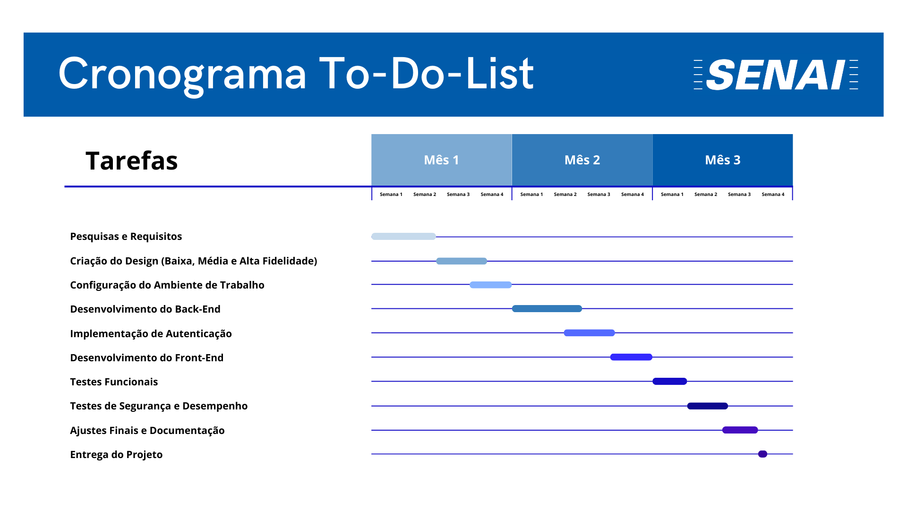
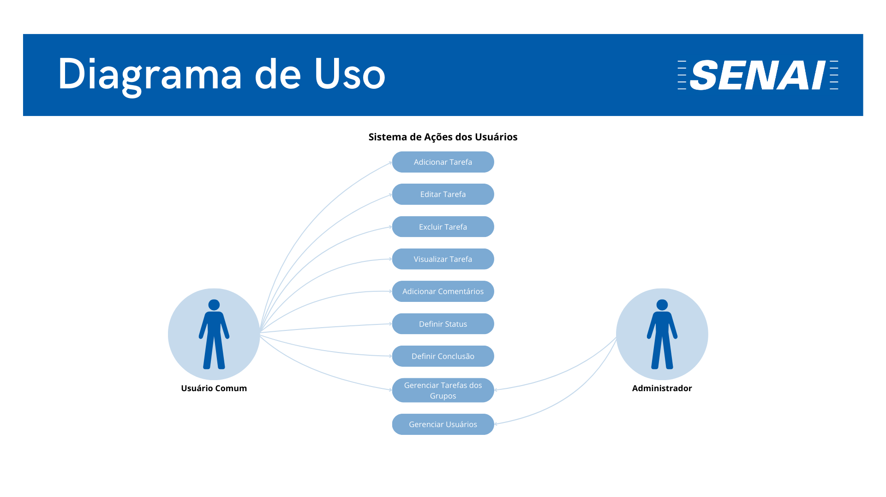
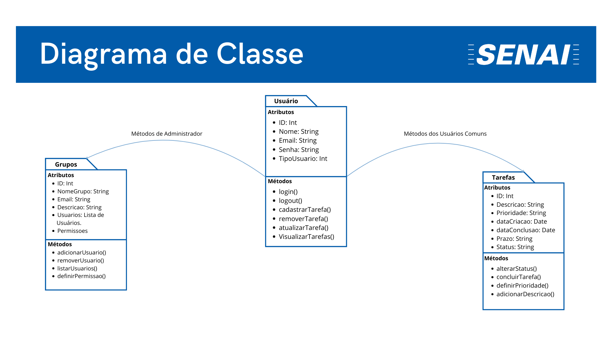
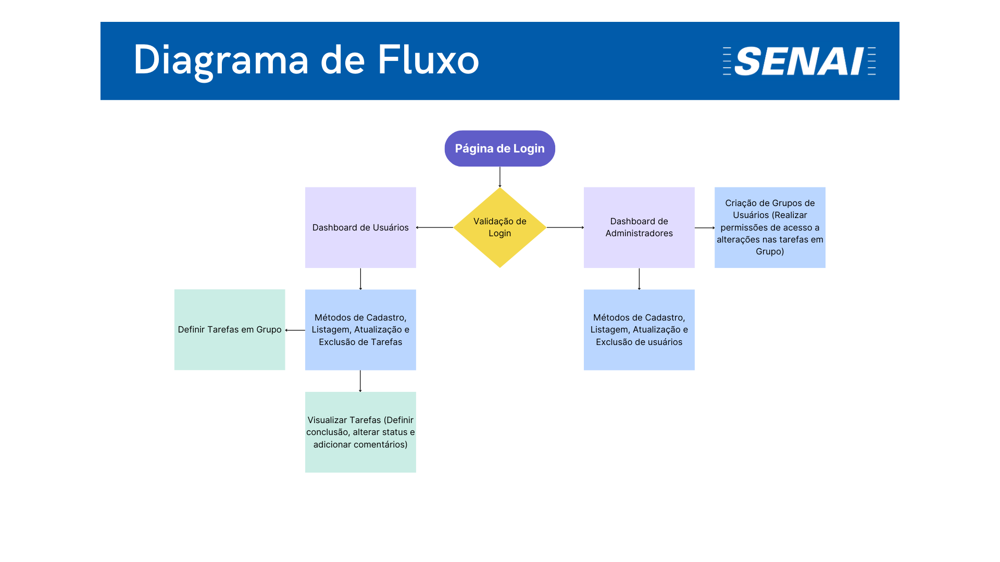

# Projeto To-Do-List
 

    

 

>  ## _índice:_

- [Introdução](#introdução);
- [Objetivos do Projeto](#objetivos-do-projeto);
- [Cronograma](#cronograma);
- [Funcionalidades](#funcionalidades);
- [Design e Estilos](#design-e-estilos);
- [Análise de riscos](#análise-de-riscos);
- [Estrutura de Programação](#estrutura-de-programação);

>  ## _Introdução_
A organização eficiente das tarefas diárias é um desafio constante para muitas instituições, incluindo o SENAI. Para melhorar a produtividade e garantir que todas as atividades sejam executadas de forma ordenada e dentro dos prazos estabelecidos, a escola SENAI identificou a necessidade de uma solução simples e eficaz. Em resposta a essa demanda, fui encarregado de desenvolver uma aplicação de gerenciamento de tarefas (To-Do-List) voltada especificamente para os colaboradores da instituição.

Este projeto visa fornecer uma ferramenta prática e intuitiva que permitirá aos colaboradores organizar suas tarefas de maneira mais eficiente e segura. A aplicação não apenas facilitará o acompanhamento e a conclusão das atividades, mas também promoverá um ambiente de trabalho mais organizado e produtivo, contribuindo positivamente para o cumprimento dos objetivos institucionais.

 

> ## _Objetivos do Projeto_
Fornecer uma ferramenta intuitiva e eficiente para a organização de tarefas dos colaboradores.  
Os principais objetivos desse sistema, são: 

**1. Específicos:**
Automatizar o processo de gerenciamento de tarefas.

 

**2. Mensuráveis:**
Acompanhar a quantidade de tarefas concluídas semanalmente.

 

**3. Atingíveis:**
Garantir que o sistema seja acessível e fácil de usar para todos os colaboradores.

 

**4. Relevantes:**
Aumentar a produtividade e eficiência dos colaboradores na execução de suas tarefas.

 

**5. Temporais:**
Concluir o desenvolvimento e implementação do projeto em 3 meses.

 

> ## _Cronograma_
O cronograma será divido em três meses:

### Mês 1: Planejamento e Design

**1. Semana 1-2: Pesquisa e Requisitos**
- Coleta de requisitos junto aos stakeholders.
- Definição das funcionalidades principais.
- Criação da documentação inicial do projeto.

 

**2. Semana 3: Prototipagem de Baixa Fidelidade**
- Desenvolvimento de wireframes e protótipos de baixa fidelidade.
- Revisão e ajustes com base no feedback dos stakeholders.

 

**3. Semana 4: Prototipagem de Média Fidelidade**
- Criação de protótipos de média fidelidade, incorporando feedbacks.
- Apresentação e aprovação dos protótipos pelo cliente.

### Mês 2: Desenvolvimento

**1. Semana 5-6: Configuração do Ambiente de Desenvolvimento**
- Configuração do ambiente de desenvolvimento (React, Node.js, MongoDB).
- Implementação das funcionalidades principais (CRUD de tarefas, interface básica).

 

**2. Semana 7: Desenvolvimento do Backend**
- Desenvolvimento das APIs em Node.js para gerenciamento de tarefas.
- Configuração e integração do MongoDB com o backend.

 

**3. Semana 8: Implementação de Autenticação**
- Implementação do sistema de autenticação usando JWT.
- Testes iniciais de autenticação e segurança.

 

**3. Semana 9: Desenvolvimento do Frontend**
- Desenvolvimento da interface de usuário com React e Bootstrap.
- Implementação de funcionalidades dinâmicas, como atualização em tempo real de tarefas.

### Mês 3: Testes e Implementação

**1. Semana 10: Testes Funcionais**
- Realização de testes funcionais e correção de bugs.
- Testes de usabilidade com grupos de usuários.

 

**2. Semana 11: Testes de Segurança e Desempenho**
- Testes de segurança (prevenção contra injeções de código, acessos não autorizados).
- Testes de desempenho, incluindo carga e tempo de resposta.

 

**3. Semana 12: Ajustes Finais e Documentação**
- Realização de ajustes finais com base nos testes.
- Finalização da documentação do projeto.
- Preparação e implementação da aplicação em ambiente de produção.

 

**3. Semana 13: Entrega do Projeto**
- Apresentação do projeto finalizado para o cliente.
- Entrega do projeto para o cliente.

 

**_Cronograma de Gantt do Projeto:_**

    

 

> ## _Funcionalidades_

### _Manual de Instrução:_

**_Fluxograma de Uso:_**

    

 
Este diagrama destaca as ações possíveis para os usuários comuns e administradores:

1. Usuário Comum:
    - Adicionar, editar, excluir e visualizar tarefas.
    - Adicionar comentários, definir status e conclusão das tarefas.
2. Administrador:
    - Além das funções do usuário comum, o administrador pode gerenciar grupos de tarefas e usuários.

 

**_Fluxograma de Classe:_**

    

 

Este diagrama mostra as classes principais do sistema e como elas interagem:

- **Usuário**: Contém atributos como ID, nome, email, senha e tipo de usuário. Os métodos associados incluem login, logout, cadastro de tarefas, remoção, atualização e visualização de tarefas.

- **Tarefas**: Classe que define as tarefas, com atributos como ID, descrição, prioridade, datas de criação e conclusão, prazo e status. Os métodos incluem alterar o status, concluir, definir prioridade e adicionar descrição.

- **Grupos**: Gerencia os grupos de usuários, contendo atributos como ID, nome do grupo, email, descrição, lista de usuários e permissões. Os métodos incluem adicionar, remover e listar usuários, além de definir permissões.

 

**_Fluxograma de Fluxo:_**

    

 

Este diagrama representa o fluxo geral do sistema, desde a página de login até as diversas funcionalidades disponíveis para os usuários e administradores.

- **Página de Login**: É o ponto de entrada do sistema onde o usuário insere suas credenciais. A validação do login determina se o usuário é comum ou um administrador.

- **Dashboard de Usuários**: Após o login, os usuários comuns são direcionados para essa área onde podem gerenciar suas tarefas, incluindo métodos para cadastrar, listar, atualizar e excluir tarefas.

- **Dashboard de Administradores**: Os administradores são direcionados para uma dashboard específica onde podem gerenciar tanto usuários quanto tarefas, com a possibilidade de criação e gestão de grupos de usuários, incluindo a definição de permissões.

- **Definir Tarefas em Grupo**: Funcionalidade que permite a criação e atribuição de tarefas para grupos específicos.

- **Visualizar Tarefas**: Os usuários podem ver as tarefas atribuídas a eles, podendo alterar o status, adicionar comentários e marcar a conclusão das tarefas.

 

Esses diagramas juntos fornecem uma visão completa das funcionalidades e estrutura do sistema, desde a autenticação até o gerenciamento de tarefas e usuários, garantindo que tanto os usuários comuns quanto os administradores possam realizar suas atividades de forma eficiente.

 

> ## _Design e Estilos_

 

> ## _Análise de riscos_
Aqui estão alguns possíveis problemas que podem ocorrer durante o projeto:  

**1. Riscos Funcionais:**
- Sincronização de Tarefas: Risco de falha na sincronização entre dispositivos, podendo resultar em informações desatualizadas. Mitigação: Testes extensivos de sincronização.
- Exclusão de Tarefas: Possíveis dificuldades na exclusão de tarefas, levando ao acúmulo de informações desnecessárias. Mitigação: Sistema de confirmação de exclusão e testes rigorosos.
 

**2. Riscos de Segurança:**
- Injeção de Código: Risco de inserção de scripts maliciosos nos campos de entrada. Mitigação: Validação e sanitização das entradas de dados.
- Acesso Não Autorizado: Possibilidade de acessos não autorizados a informações sensíveis. Mitigação: Autenticação segura com multifator e criptografia de dados.
 

**3. Riscos de Desempenho:**
- Lentidão no Carregamento: O aumento do número de tarefas pode causar lentidão. Mitigação: Otimização de consultas e lazy loading.
- Sobrecarga do Servidor: Acesso simultâneo por muitos usuários pode sobrecarregar o servidor. Mitigação: Balanceamento de carga e escalabilidade automática.
 

**4. Riscos de Confiabilidade:**
- Perda de Dados: Risco de perda de dados em falhas ou manutenção. Mitigação: Backups automáticos regulares.
- Atualizações Problemáticas: Atualizações podem introduzir novos bugs. Mitigação: Testes em ambiente de staging antes da produção.
 

**5. Riscos de Usabilidade:**
- Interface Complexa: Interface pode ser difícil de usar para alguns colaboradores. Mitigação: Testes de usabilidade para garantir uma interface intuitiva.
- Compatibilidade de Dispositivos: A aplicação pode não funcionar corretamente em todos os dispositivos. Mitigação: Testes de compatibilidade com diferentes dispositivos e navegadores.

 

> ## _Estrutura de Programação_
**Framework React**
 
React é uma biblioteca JavaScript amplamente utilizada para a construção de interfaces de usuário (UI) dinâmicas e interativas. Desenvolvido pelo Facebook, ele permite a criação de componentes reutilizáveis, facilitando a manutenção e a escalabilidade de projetos. React oferece uma abordagem eficiente para a atualização da UI com seu Virtual DOM, o que resulta em melhor desempenho e uma experiência de usuário mais fluida.

**Compilador Node.js**
 
Node.js é um ambiente de execução JavaScript no lado do servidor, que permite a construção de aplicações escaláveis e de alta performance. Ele é baseado no motor V8 do Google Chrome e possibilita a criação de servidores web rápidos, suportando um grande número de conexões simultâneas. Node.js é conhecido por sua eficiência em lidar com operações de I/O, tornando-o ideal para aplicações em tempo real.

**MongoDB**
 
MongoDB é um banco de dados NoSQL que armazena dados em documentos JSON-like, oferecendo flexibilidade e escalabilidade para aplicações modernas. Diferente dos bancos de dados relacionais tradicionais, o MongoDB permite a manipulação e consulta de grandes volumes de dados não estruturados de forma ágil. Sua arquitetura distribuída facilita o gerenciamento de dados em larga escala e oferece alta disponibilidade.

**Autenticador JWT**
 
JWT (JSON Web Token) é um padrão de autenticação e troca de informações seguras entre partes, utilizado principalmente em sistemas web. Ele permite a autenticação de usuários sem a necessidade de manter sessões no servidor, facilitando a escalabilidade e melhorando a segurança. O JWT contém informações codificadas sobre o usuário e sua validade, permitindo a verificação de identidade de forma simples e eficiente.

**Bootstrap**
 
Bootstrap é um popular framework de front-end utilizado para criar interfaces web responsivas e modernas. Desenvolvido pela equipe do Twitter, ele oferece uma ampla gama de componentes prontos, como botões e formulários, além de um sistema de grid flexível que facilita o design para diferentes dispositivos.

**Github**
 
Além disso, utilizamos o Git como sistema de controle de versão, permitindo o armazenamento seguro de todos os arquivos do projeto e da documentação. O Git não só facilita a colaboração entre os membros da equipe, como também assegura que todas as mudanças no código sejam registradas e possam ser revertidas, se necessário, garantindo assim um desenvolvimento mais organizado e controlado.

